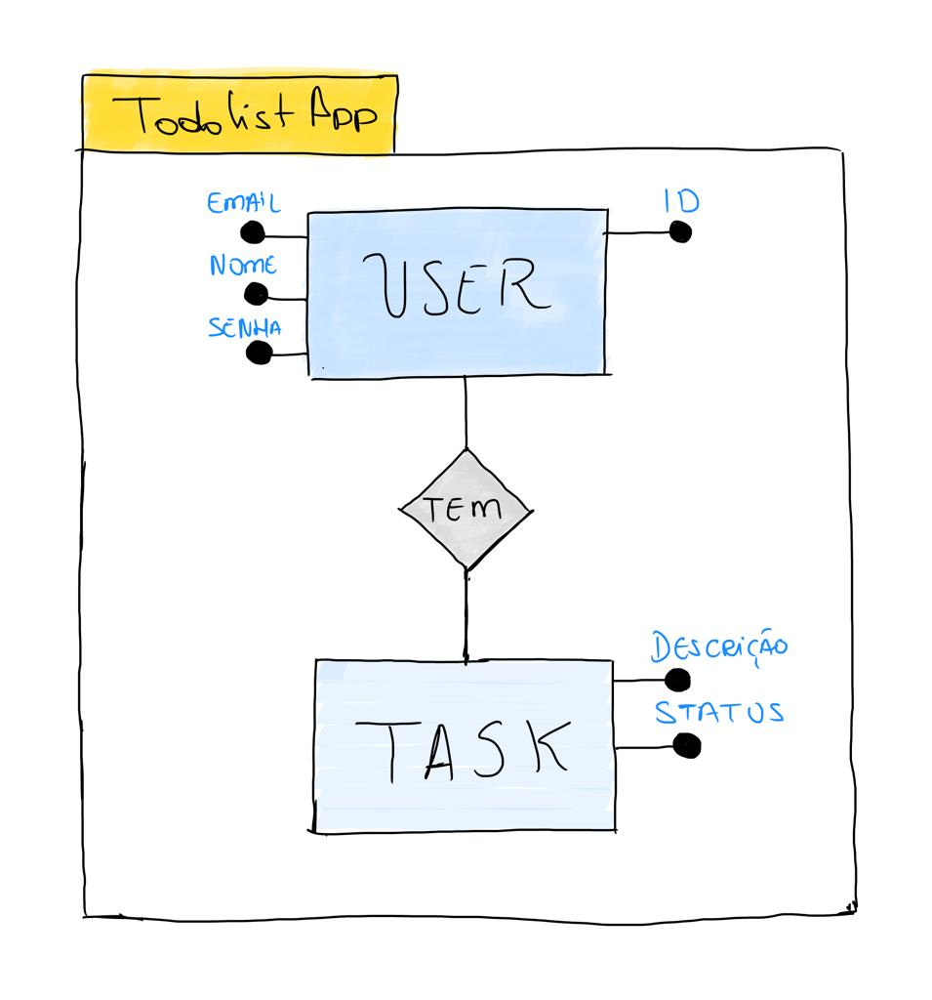
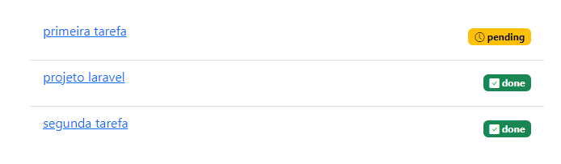

# Configuração de Acesso ao Banco de Dados

Na capítulo sobre controladores, abordamos o seu papel de orquestrador das ações da aplicação. Uma das finalidades do controlador é usar modelos para acessar a camada de dados e obter e levar as informações ao banco de dados.

Agora vamos explorar o acesso ao banco de dados de acordo com o modelo `MVC` e os recursos do Laravel.

O primeiro passo é configurar o acesso ao banco de dados. Para tanto, vamos precisar configurar dois arquivos:
- config/database.php
- .env

O arquivo `config/database.php` é utilizado exclusivamente para guardar as configurações a respeito do banco de dados da aplicação. Já o arquivo `.env` guarda informações de configurações de modo geral, inclusive configurações do banco. As informações presentes no arquivo `.env` a respeito do banco de dados também estão presentes no arquivo. Você deve estar se perguntando: por que há configuração em dois locais?

O arquivo `.env` não deve ser compartilhado publicamente, ele não fica no github ou outro repositório de código e, portanto, é o lugar onde podemos ter mais segurança para adicionar, por exemplo, senha de acesso ao banco. As informações necessárias no `database.php` podem ser definidas apenas no `.env`. Desse modo, não sendo necessário definí-las no `database.php`.

## Usando banco de dados SQLite

Vamos iniciar as nossas configurações com um banco mais simples de usar: O `SQLite`. O banco será um arquivo no disco e ficará armazenado em nosso projeto.

O primeiro passo é criar o arquivo `database.sqlite` na pasta `database/`. O arquivo será armazenado neste local por conveniência. É possível armazená-lo em outro lugar.

O segundo passo é configurar o arquivo database para usar, por padrão, o banco sqlite que criamos. Para tanto, abra o arquivo `database/database.php`. 

```php
//trecho de código do arquivo database.php
<?php
use Illuminate\Support\Str;

return [

    'default' => env('SQLITE_CONNECTION', 'sqlite'),

    'connections' => [

        'sqlite' => [
            'driver' => 'sqlite',
            'url' => env('DATABASE_URL'),
            'database' => env('DB_DATABASE', database_path('database.sqlite')),
            'prefix' => '',
            'foreign_key_constraints' => env('DB_FOREIGN_KEYS', true),
        ],

        'mysql' => [
            'driver' => 'mysql',
            'url' => env('DATABASE_URL'),
            'host' => env('DB_HOST', '127.0.0.1'),
            'port' => env('DB_PORT', '3306'),
            'database' => env('DB_DATABASE', 'forge'),
            'username' => env('DB_USERNAME', 'forge'),
            'password' => env('DB_PASSWORD', ''),
            'unix_socket' => env('DB_SOCKET', ''),
            'charset' => 'utf8mb4',
            'collation' => 'utf8mb4_unicode_ci',
            'prefix' => '',
            'prefix_indexes' => true,
            'strict' => true,
            'engine' => null,
            'options' => extension_loaded('pdo_mysql') ? array_filter([
                PDO::MYSQL_ATTR_SSL_CA => env('MYSQL_ATTR_SSL_CA'),
            ]) : [],
        ],
    //aqui tem mais conexão que foram omitidas porque não as utilizaremos
    ],
];
```

No trecho de código acima, temos alguns pontos importantes da relação de `database.php` e `.env`. No arquivo `database.php` sempre que houver o uso da função `env()`, estamos buscando uma informação presente no arquivo. Dito isso, vamos para configuração do SQLite.

Observe a seguinte linha no arquivo database.php ilustrada abaixo:

```php
'default' => env('SQLITE_CONNECTION', 'sqlite'),
```

A declaração `default` indica qual a conexão padrão que nosso projeto utilizará para o banco de dados. Neste caso, temos o uso da função `env()`. O que essa declaração significa? Primeiro, que vamos procurar uma variável `SQLITE_CONNECTION` no arquivo `.env` caso ela não seja definida lá, então vamos usar o segundo argumento como sendo a conexão padrão. No exemplo ilustrado, o argumento é `sqlite`.

O arquivo `.env` vem com várias definições padrão de configurações do projeto. A parte que interessa para o nosso banco de dados funcionar está destacada abaixo:

```php
#mysql connection
# MYSQL_CONNECTION=mysql
# DB_HOST=127.0.0.1
# DB_PORT=3306
# DB_DATABASE=laravel
# DB_USERNAME=root
# DB_PASSWORD=romerito

#sqlite connection
SQLITE_CONNECTION=sqlite
```

Observe que o arquivo tem duas configurações e o `#` é um comentário na configuração do MYSql que não estamos utilizando agora. Observe também que as declarações sempre são pares com a chave da configuração e o seu valor.

Por fim, para testar a sua conexão com o banco de dados basta fazer o seguinte procedimento:

```bash
php artisan tinker
```

O `tinker` permite que você  acesse um interpretador de comando possibilitando o teste de recursos da aplicação, digamos, de maneira isolada. Neste exemplo de configuração do banco, você não precisa abrir uma página para ver se a conexão está ativa. 

Com o `tinker` aberto, digite a seguinte declaração no interpretador(código php):

```php
\DB::connection()->getPDO()
```

O resultado esperado está ilustrado a seguir para a conexão utilizando o SQLite:

```
=> PDO {#4506
     inTransaction: false,   
     attributes: {
       CASE: NATURAL,        
       ERRMODE: EXCEPTION,   
       PERSISTENT: false,    
       DRIVER_NAME: "sqlite",
       ORACLE_NULLS: NATURAL,
       CLIENT_VERSION: "3.33.0",
       SERVER_VERSION: "3.33.0",
       STATEMENT_CLASS: [
         "PDOStatement",
       ],
       DEFAULT_FETCH_MODE: BOTH,
     },
   }
```

## Usando banco de dados MYSql

Na seção anterior, vimos como conectar nossa aplicação com o banco de dados SQLite. Agora vamos ver como fazer o mesmo com o `MySQL`. O primeiro passo é ter o MySQL instalado em sua máquina. Neste documento, será considerado o ambiente local de desenvolvimento e isso é importante na configuração da conexão com banco de dados.

Após a instalação do MySQL, você deve criar o esquema de banco de dados da sua aplicação. Não precisa criar as tabelas em si e seus relacionamentos neste momento. Na próxima seção, vamos falar sobre as tabelas. Para criar o esquema de banco de dados do exemplo que estamos vendo, utilizarei o seguinte comando no MySQL:

```SQL
create database todolistapp;
```

Em seguida, vamos configurar o arquivo `.env` da seguinte forma:

```bash
# mysql connection
MYSQL_CONNECTION=mysql
DB_HOST=127.0.0.1 
DB_PORT=3306
DB_DATABASE=todolistapp
DB_USERNAME=root
DB_PASSWORD=romerito
```

Observe que a configuração para o MySQL possui mais informações que o SQLite. Vamos lá:
 - MYSQL_CONNECTION: indica o nome da conexão que vamos utilizar que é `mysql`. 
 - DB_HOST: indica o host do banco, ou seja, o lugar onde o banco está instalado. Neste exemplo, é o mesmo da aplicação (ambiente local).
 - DB_PORT: é a porta utilizada para comunicação com banco e está definida com a porta padrão do MySQL.
 - DB_DATABASE: indica o nome do esquema de banco de dados que você tem no MySQL - seu banco.
 - DB_USERNAME: nome do usuário que tem acesso ao banco para realizar operações. No exemplo, o usuário root padrão da instalação.
 - DB_PASSWORD: senha do usuário para acesso ao banco.

 Todas essas informações também podem ser inseridas no arquivo `database.php`. Entretanto, saiba que este arquivo por padrão é enviado para repositórios como GITHUB e GITLAB. Logo, dados sigilosos como senhas podem ficar públicas.

 Está confuso o fato de configurações do banco de dados e como o Laravel obtém esses dados de configurações sendo que não é recomendado ficarem definidas no arquivo `database.php`? A Resposta é simples: da mesma forma que você fez com o SQLite. Veja o trecho do código de configuração do MySQL no arquivo `database.php`:

 ```php
 //trecho do arquivo database.php com configuração do mysql
  'mysql' => [
    'driver' => 'mysql',
    'url' => env('DATABASE_URL'),
    'host' => env('DB_HOST', '127.0.0.1'),
    'port' => env('DB_PORT', '3306'),
    'database' => env('DB_DATABASE', 'forge'),
    'username' => env('DB_USERNAME', 'forge'),
    'password' => env('DB_PASSWORD', ''),
    'unix_socket' => env('DB_SOCKET', ''),
    'charset' => 'utf8mb4',
    'collation' => 'utf8mb4_unicode_ci',
    'prefix' => '',
    'prefix_indexes' => true,
    'strict' => true,
    'engine' => null,
    'options' => extension_loaded('pdo_mysql') ? array_filter([
        PDO::MYSQL_ATTR_SSL_CA => env('MYSQL_ATTR_SSL_CA'),
    ]) : [],
  ],
 ```

Nas configurações acima, observe o uso da funçao `env()` para obter os valores de configuração do banco que foram adicionados ao arquivov `.env`. Portanto, você pode definir `DB_HOST`, `DB_PORT`, `DB_DATABASE`, `DB_USERNAME` e `DB_PASSWORD` no arquivo .env e resgatá-los com `.env()`.

Para testar se a conexão com MySQL e seu banco estão satisfeitas, use o mesmo procedimento indicado no teste do SQLite.

Até aqui você deve estar fazendo a seguinte pergunta: Onde estão as tabelas do banco de dados? Veremos a resposta a seguir.

# Migrations

O nosso banco de dados será construído a partir do conceito de Migrations (migrações). As migrações podem ser vistas de forma análoga ao versionamento do software. Imagine que você lança uma versão inicial do seu projeto, digamos versão 0.1, e continua trabalhando em novas funcionalidades e lança versões novas 0.2, 0.3 e assim por dia. Com o Banco de dados é a mesma coisa quando utilizamos as migrations.

Com as migrations podemos criar, alterar ou remover tabelas da nossa base de dados sem necessariamente manipular o MySQL diretamente. 

No Laravel, podemos definir migrations para criar e alterar tabelas. Considerando isso, o nosso banco é definido pela criação de migrações que especificam as tabelas e também pela alteração das tabelas criadas. Dessa maneira, cada novo conjunto de migrações que definiem novas tabelas seria uma nova versão do banco.

## Criando Migrations

Antes de criarmos uma migração vamos observar a figura abaixo que define, por hora, o esquema de banco de dados da aplicação de exemplo:

 

O esquema de banco de dados da aplicação terá duas tabelas para guardar usuários e tarefas. 

Podemos utilizar o `artisan` para criar uma migration. Vamos fazer a migration para a tabela `tasks` com  o comando abaixo:

> php artisan make:migration create_tasks_table

Indicamos no comando acima que vamos criar uma migration e seu nome será `create_tasks_table`. O resultado é o arquivo `create_tasks_table.php` armazenado na pasta `database/migrations/create_tasks_table.php`. O conteúdo dele é ilustrado abaixo:

```php
// Trecho da migração de criação da tabela tarefas
<?php

use Illuminate\Database\Migrations\Migration;
use Illuminate\Database\Schema\Blueprint;
use Illuminate\Support\Facades\Schema;

return new class extends Migration
{
    public function up()
    {
        Schema::create('tasks', function (Blueprint $table) {
            $table->id();            
            $table->string('description'); 
            $table->unsignedBigInteger('user_id'); 
            $table->boolean('status')->default(false);            
            $table->foreign('user_id')
                ->references('id')
                ->on('users');
            
            $table->timestamps();
        });
    }

    public function down()
    {
        Schema::dropIfExists('tasks');
    }
};
```

A migration vem com duas funções: `up` e `down`. A função `up` é utilizada para criar uma tabela no banco de dados com as definições que estão dentro da função `Schema::create`. Já a função `down` tem o papel de excluir a tabela do banco de dados. A saber o nome da tabela será `tasks` e isso foi definido quando adicionamos o arquivo `create_tasks_table`.

A esta altura você deve ter observado o conteúdo da função `up` e notado alguns similaridades com as definições de tabela que geralmente fazemos no MySQL. Se pensou assim, está corretíssimo. Através da variável `$table` podemos definir as colunas: `id`, `description`, `status` e outras que forem necessários.

## Relacionamentos nas migrations

Você deve ter notado na figura que ilustra as entidades User e Task que elas possuem um relacionamento. Esse relacionamento deve ser expresso na migração para ser adicionado no MySQL. Ele é expresso por `chave-estrangeira` e são necessários dois passos:

- Definir a coluna que vai guardar a chave-estrangeira: 
```php
$table->unsignedBigInteger('user_id');
```
- Adicionar a definição de chave estrangeira:
```php
 //indica o a coluna chave estrangeira
 $table->foreign('user_id')
    ->references('id') //id na tabela original
    ->on('users'); //indica a tabela original
```

# Modelos

Nas seções anteriores, a configuração de conexão com o banco de dados foi realizada e um exemplo de migations foi criado. Observe nos arquivos presentes em `database/migration` que há várias outas migrations que o próprio Laravel utiliza. Voltaremos a falar delas quando formos adicionar autenticação de usuários ao sistema. Por hora, observe na pasta há uma migration denominada `create_users_table`, que adicionará a tabela de `usuários`. Portanto, nosso esquema de banco de dados para a aplicação `todolist` está pronto(Considerando as entidades Task e User).

Para acessarmos os dados do banco, vamos utilizar o conceito de modelos. A camada de modelo inclui os modelos que temos e eles estão relacionados as endidades que modelamos para o nosso problema. No caso do exemplo discutido neste exemplo temos dois modelos: `User` e `Task`. O modelo `User` já vem pronto e foi definido pela equipe do Laravel. Nós podemos modificá-lo para atender demandas específicas da nossa aplicação. 

Desta maneira precisamos criar o nosso modelo `Task` que é específico do nosso problema: gerenciar tarefas.

## Criando Modelos

O Laravel fornece um comando simples e intuitivo para criação de modelos. O comando abaixo vai criar o modelo `Task`:

> php artisan make:model Task

O resultado do comando é ilustrado abaixo:

```php
//Código do modelo App\Models\Task
<?php

namespace App\Models;

use Illuminate\Database\Eloquent\Factories\HasFactory;
use Illuminate\Database\Eloquent\Model;

class Task extends Model
{
    use HasFactory;

}

```

O modelo gerado pelo artisan nos permite realizar muitas operacoes de acesso ao banco de dados. Nas secoes seguintes, vamos ver alguns exemplos de como usar o modelo.

## Relacionamentos entre entidades

Até aqui já temos uma boa infraestrutura para o acesso ao banco de dados da nossa aplicacão. Já realizamos a configuração com o banco de dados, definimos uma migracão para criar a tabela `tasks` e acabamos de definir um modelo.

Há um detalhe importante para fecharmos a implementacão de acesso ao banco de dados para este exemplo (até aqui pelo menos). Trata-se de definir no modelo Task o relacionamento que existe na migracão e foi implementado no banco de dados. Relacionamento 1:N entre usuários e tarefas.

A classe `Task` vai passar a ter a seguinte implementacão:

```php
// Trecho de Task.php
<?php
namespace App\Models;

use Illuminate\Database\Eloquent\Factories\HasFactory;
use Illuminate\Database\Eloquent\Model;

class Task extends Model
{
    use HasFactory;
    public function user()
    {
        return $this->belongsTo(User::class, 'user_id', 'id');
    }
}
```

Na implementacão da função `user()`, nós indicamos para o Laravel recuperar o usuário relacionado a tarefa (Lembre-se que cada tarefa tem um usuário associado a ela). Isso é especificado pelos parâmetros da funcão `belongsTo` (pertence à): `User::class`, `user_id`, `id`. Esta função faz parte do Eloquent que é responsável por facilitar o acesso a banco de dados tanto através de modelos como funções auxiliares para os relacionamentos entre as entidades.

Na função `belongsTo()`, o primeiro argumento indica a classe a qual o modelo `Task` está relacionado que é a classe `User`. O segundo argumento, `user_id`, indica qual é a chave estrangeira presente na tabela `tasks` (onde ficam as tarefas). Por fim, o argumento `id` é a coluna na tabela usuários que está relacionada a chave estrangeira `user_id`.

A funcão `user()` vai permitir que o acesso ao usuário relacionado com uma tarefa específica seja feita de forma mais prática no contexto do uso da linguagem php. Na secção seguinte, vamos explorar o uso dessa função e você verá o quanto ela é útil. Muitas outras podem ser definidas de forma análoga a esta.

# Modelos e Controladores

Se você chegou até aqui na leitura e também aplicacão em seu projeto, suponho que já possui toda a infraestrutura de banco de dados do exemplo pronta para ser utilizada. 

Neste momento, utilizar o modelo Task para acessar o banco de dados e realizar operacões básicas. Entretanto, vamos fazer isso diretamente do controlador TaskController e vincular os dados as views que já temos no projeto. Observe a pasta `resources/views/todolist`. 

## Operação Salvar Tarefa

A operação de salvar um registro de tarefas no banco de dados envolve os seguintes arquivos do projeto: `TaskController`, `todolist/create.blade.php` e `app/Models/Task`.

Vamos iniciar pelo fato de já existir duas rotas para criação de tarefas no banco de dados. São elas: `/tasks/create` e `/tasks`. Se está com dúvida rode o comando a seguir (Aproveite e veja o capítulo sobre controladores, espcíficamente a parte sobre `Resource`.):

> php artisan route:list

As rotas mencionadas acima estão associdadas a duas fuções do controlador `TaskController` que são: `create()` e `store()`. O código da função `create()` é ilustrado a seguir:

```php
//trecho de código do arquivo TaskController.php
public function create()
{
    return view('todolist.create');
}
```

Esta função vai simplemente retornar para o usuário o formulário para preenchimento dos dados da tarefa, que neste exemplo é apenas uma descrição. Abaixo segue trecho do formulário (sem CSS).

```html
<!-- Trecho de create.blade.php -->
<form action="{{url('/tasks')}}" method="POST">
    @csrf
    <div class="row m-3">
        <label>Description</label>
        <div>
            <input type="text" name="task" id="task">
        </div>                                                       
    </div>
    <div>
        <div>
            <button type="submit">Entrar</button>
        </div>
    </div> 
</form>
```

Este formulário é parte da resposta que o usuário tem quando acessar `/tasks/create`. Agora que tem o formulário, ele preenche e envia para o servidor. Neste formulário, tem informações importantes para o servidor saber o que fazer com o envio. 

Primeiro, o formulário será enviado para uma rota `/tasks` usando uma requisição do tipo `method=POST`. Além disso, adicionarmos a tag blade `@csrf` que permite dar mais proteção contra o ataque LINK.

Como sabermos que função de TaskController vai processar o formulário enviado para a rota com o método especificado no parágrafo anterior? Podemos observar a lista de rotas da aplicação com `php artisan route:list` novamente e ver o seguinte:

```bash
POST                    tasks ...... tasks.store › TaskController@store
```

Observe que o formulário será enviado para a função `store` de `TaskController`. Logo, vamos focar na implementação desta função para providenciar o cadastro da tarefa. A seguir o código da função `store()`:

```php
// trecho de TaskController.php
public function store(Request $request)
{
    $description = $request->post('task');
    $task = new Task;
    $task->description = $description;
    $task->user_id = 1;
    $task->save();

    return redirect(url('/tasks'));
}
```

A função `store()` tem um argumento que é um objeto da classe `Request`. Este objeto é injetado na função pelo Laravel. Com ele podemos obter informações da requisição enviada para esta função. É exatamente isso que faremos. Primeiro, vamos pegar o dado do formulário cujo `input` tem o nome de `task`. Para isto, basta usar a função `$request->post()`. Em seguida, criamos uma tarefa `$task = new Task;`, adicionamos a ela o usuário que é dono da tarefa e, por fim, salvamos. Por questão de simplicidade, há um usuário padrão no sistema e seu `id=1`. A função `save()` faz a operação `INSERT` do `SQL`. Por fim, o usuário é redirecionado para a página de listagem das tarefas.  

## Listar todas as tarefas

Você observou na seção anterior que ao salvarmos uma nova tarefa o usuário é encaminhado para a rota `/tasks`. Esta rota é usada para listar todas as tarefas do usuário. A função do controlador `TaskController` associada a ela é `index()`. A implementação da rota está ilustrada a seguir:

```php
//trecho de código do arquivo TaskController.php
public function index()
{
    $tasks = Task::all();
    return view('todolist.dashboard', [
        'tasks' => $tasks,
    ]);
}
```

Observe dois detalhes: o uso do modelo `Task` e também a passagem da variável `$tasks` para a função `view`. 

Primeiro, vamos iniciar pelo uso de Task::all(). Esta função fará uma consulta ao banco de dados do tipo `SELECT * FROM tasks`. O resultado será armazenado em `$tasks`. 

Segundo, com o resultado das tarefas guardado em `$tasks` vamos construir a página de listagem das tarefas. Para isso, utilizamos o template `todolist.dashboard`. Abaixo segue o trecho de código onde os dados das tarefas são utilizados para construir a página.

```html
<!-- Trecho de dashboard.blade.php -->
<ul class="list-group list-group-flush mt-4">
    @foreach ($tasks as $item)
    <li class="list-group-item d-flex flex-wrap align-items-center">                            
        <p class="flex-grow-1">
            <a href="{{url('/tasks', ['id'=>$item->id])}}">
                {{$item->description}}
            </a>
        </p>
        @if ($item->status)
        <span class="badge bg-success">
            <i class="bi bi-check-square-fill"></i>
            done
        </span>    
        @else
        <span class="badge bg-warning text-black">
            <i class="bi bi-clock"></i>
            pending
        </span>                            
        @endif
    </li>   
    @endforeach
</ul>
```

Esse código vai gerar a seguint tela: 

Utilizamos a tag blade `@foreach` para realizar um laço de repetição com as tarefas que conectamos ao template. Para cada `$item` da lista, vamos adicionar um elemento HTML `li` a página. Neste elemento, haverá duas informações: `$item->description` e `$item->status`. O status é utilizado na declaração `@if @else @endif` para determinar uma mensagem mais amigável na interface. 

## Editar Tarefa

A edição de tarefas também envole o uso de duas rotas e, no nosso exemplo, duas funções no controlador `TaskController`. As rotas são definidas como: `/tasks/{task}/edit` e `tasks/{task}`. As funções no controlador são `edit()` e `update()`, respectivamente.

A rota para edição de uma função precisa de um parâmetro cujo nome está definido como `task` e o valor a ser passado para ele será um inteiro indicando o id da tarefa específica. Por exemplo, a rota `/tasks/1/edit` indica que estamos solicitando ao servidor o formulário para edição da tarefa `id=1`. A função no controlador responsável por isso é a seguinte:

```php
//trecho do controlador TaskController.php
public function edit($id)
{
    $task = Task::find ($id);

    return view('todolist.edit', [
        'task' => $task,
    ]);
}
```

Nesta função, vamos retonar o template `todolist.edit` e passaremos para ele a tarefa a ser editada. Por que fazemos isso? Isso é feito para que o formulário acessado pelo usuário para edição tenha os dados da tarefa que ele deseja editar.

O código do formulário para edição está definida como a seguir:

```HTML
<!-- trecho de edit.blade.php -->
<form action="{{url('/tasks', ['task'=>$task->id])}}" method="POST">
    @csrf
    @method('PUT')
    <div class="row m-3">
        <label for="task" class="label">Description</label>
        <div class="col">
            <input class="form-control" type="text" name="task" id="task" value="{{$task->description}}">
        </div>                                                       
    </div>
    <div class="row m-3">
        <div class="d-grid justify-content-end">
            <button type="submit" class="btn btn-success btn-sm btn-block">Entrar</button>
        </div>
    </div> 
</form>
```` 

A rota para onde este formulário será enviada é `/tasks/{task}` e utiliza o verbo HTTP `PUT`. Entretanto, o HTML não utiliza este método. Portanto, definidomos `method=POST` e adicionar a tag blade `@method('PUT')` dentro do formulário. Desta maneira, o Controlador receberá a requisção de atualização da tarefa na rota correta. Observe que utilizar na action a seguinte atribuição `{{url('/tasks', ['task'=>$task->id])}}` . Aqui indicamos que vamos utilizar a rota `/tasks/{task}` onde `{task}` será o valor de `$task->id`. A tarefa que estamos tentando editar. Imaginando que você queira editar a primeira tarefa salva no banco de dados e de `id=1`, então teríamos `/tasks/1`.

Ao chegar no servidor, a função que vai processar a atualização dos dados é `update()` cujo código é ilustrado abaixo:

```php
<!-- trecho de TaskController.php -->
public function update(Request $request, $id)
{
    $task = Task::find($id);

    if (NULL !== $request->post('task'))
        $task->description = $request->post('task');
    else 
        $task->status = 1;

    $task->save();

    return redirect()->to(route('tasks.show', [
        'task' => $task->id,
    ]));
}
```

A função update recebe dois parâmetros: O `Request` que permite obter dados do formulário com novas informações da tarefa e também o `id` da tarefa que está sendo atualizada. A primeira coisa a ser feita na função é obter, através de `Task::find($id)`, a tarefa que será atualizada e em seguida obtém-se a nova descrição da tarefa usando `$request->post` (por hora somente esta atualização é realizada). Um detalhe importante é que o uso do if nesta função. Caso tenha aluma nova descrição no `$request->post`, então ela será aplicada e o status da tarefa será mantido. Por fim, salvar a atualização com $task->save() e redirecionar o usuário para rota `show`. 

## Mostrar Tarefa

A operação de mostrar uma tarefa consite em adicionar um link para a tarefa específica na listagem de tarefas que vimos na seção Listar todas as Tarefas. O código abaixo ilustra trecho do HTML que permite acessar uma tarefa específica e mostrá-la:

```html
<!-- trecho do arquivo dashboard.blade.php -->
<p class="flex-grow-1">
    <a href="{{url('/tasks', ['id'=>$item->id])}}">
        {{$item->description}}
    </a>
</p>
```

Na tag `<p>` acima, adicionamos um link. Este link é usado para acessar a página que mostra uma tarefa espefícia. Esta rota é `/tasks` e utiliza o método `GET`. A rota definida é `/tasks/{task}` e o href gerado será `tasks/1` quando `id => 1`, ou seja, quando formos mostrar a tarefa cujo `id=1`. Já no lado do servidor, temos a seguite função de `TaskController` associada a esta rota: 

```php
public function show($id)
{
    $task = Task::find($id);
    return view('todolist.show', [
        'task' => $task
    ]);
}
```

O que a função `show()` faz é buscar a tarefa no banco com base no `$id` passado na rota. A variável $task terá seu valor passado para o template `todolist.show`. Este processo é análogo ao exemplo da listagem de todas as tarefas explicado neste texto.


## Remover Tarefa

Esta operação não exige ter uma página completa como a criação/edição de tarefas. O que precisamos é de um botão que faça uma requição para rota de remoção e passe o `id` da tarefa a ser removida. 

Este botão será adicionado a página `todolist.show`. Além disso, vamos ter a seguinte condição. Se a tarefa estiver pendente, ela não pode ser removida. Sendo removida apenas quando for marcada como concluída (com o projeto em execução, você pode testar estas opções).

Abaixo segue o trecho da página show que ilsutra a definição do botão para remoção da tarefa(sem CSS):

```html
<!-- trecho do código de todolist.show -->
<div class="col-md-2">
    <div>
        @if ($task->status)
        <span >
            <form action="{{url('/tasks', ['id'=>$task->id])}}" method="POST">
                @csrf
                @method('DELETE')
                <button></button>
            </form>
        </span>    
        @else
        <span>
            <form action="{{url('/tasks', ['id'=>$task->id, 'status'=1])}}" method="POST">
                @csrf
                @method('PUT')
                <button></button>
            </form>        
        </span>    
        @endif
    </div>
</div>
```

Est trecho de código mostra apenas a parte onde definimos dois botões com base no `$task->status` da tarefa. Observe a tag `@if @else @endif` que é utilizada. Se a tarefa estiver como pendente, vamos definir um form que usa `@method('PUT')`, que já foi mencionado na seção de edição de tarefas. Neste caso, ao enviarmos o formuário de atualização do registro, não enviamos dados para alteração do texto da tarefa e de acordo com a função `update()`, ilustrada novamente abaixo, o servidor vai atualizar o status da tarefa:

```php
// trecho de TaskController.php
public function update(Request $request, $id)
{
    $task = Task::find($id);

    if (NULL !== $request->post('task'))
        $task->description = $request->post('task');
    else 
        $task->status = 1;

    $task->save();

    return redirect()->to(route('tasks.show', [
        'task' => $task->id,
    ]));
}
```

Como o formulário de atualização da tarefa para marcá-la como concluída não envia o input `task`, o código executado é o `else`. Neste caso, `$task->status = 1;`.